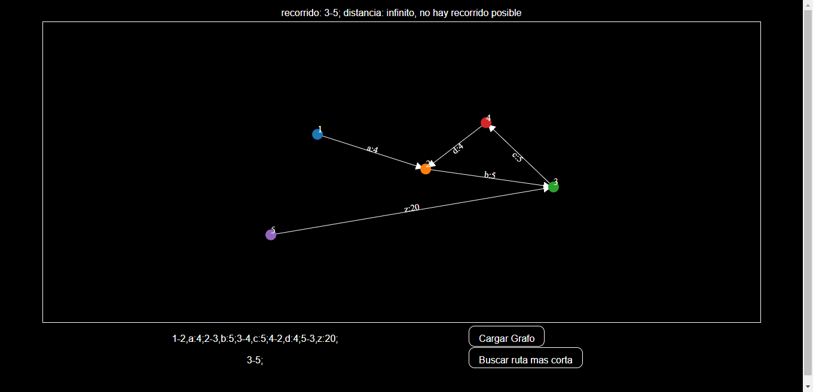

#Grafos-App

## Requires
- Perl
- Web browser

## Screenshots
<h4>Default</h4>


## Usage
- Perl
- JavaScript
```JavaScript
<script src="http://d3js.org/d3.v4.min.js" type="text/javascript"></script>
<script src="http://d3js.org/d3-selection-multi.v1.js"></script>
```
